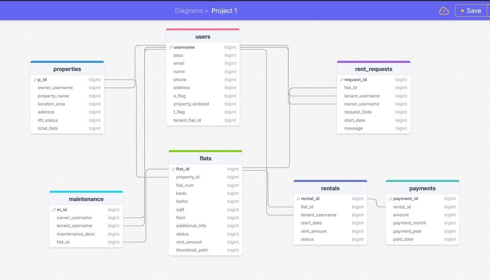

# Property Rental Management System

A Node.js/Express web app (server-rendered with a templating engine, MongoDB via Mongoose) for managing rental properties. Users can be **owners** (list properties, manage flats, approve tenants, handle maintenance and rent) and/or **tenants** (browse vacant flats, request to rent, pay rent, raise maintenance requests). A single user account can hold both roles via `o_flag` / `t_flag`.

## Tech Stack

- **Runtime:** Node.js, Express
- **Database:** MongoDB with Mongoose
- **Views:** server-rendered templates (`res.render`, e.g. EJS-style views)
- **Auth:** session-based (`req.session.user`), via a `requireAuth` middleware
- **File uploads:** `multer`-style `upload` middleware for flat images

## Domain Model

| Model | Purpose | Key fields |
|---|---|---|
| `User` | Owners and/or tenants | `username`, `pass`, `email`, `o_flag`, `t_flag`, `tenant_flat_id` |
| `Property` | A building owned by an owner | `p_id`, `owner_username`, `location_area`, `lift_status`, `total_flats` |
| `Flat` | A rentable unit inside a property | `property_id`, `flat_number`, `rent`, `status` (`vacant`/`occupied`), `tenant_id`, `images[]` |
| `RentalRequest` | A tenant's request to rent a flat | `flat_id`, `requester_username`, `owner_username`, `status` (`pending`/`accepted`/`rejected`) |
| `Rentals` | An active tenancy, created once a request is accepted | `tenant_username`, `owner_username`, `rent_amount`, `status` |
| `Payments` | Individual rent payments toward a `Rentals` record | `rental_id`, `amount`, `payment_month`, `payment_year` |
| `Maintenance` | A tenant's maintenance/repair request | `tenant_username`, `owner_username`, `description`, `status` |





## Core Flows

**Registration & login** — `registerRoutes.js` / `loginRoutes.js`. Users register with a role flag (owner/tenant) and log in with username + password; session stores a trimmed copy of the user document.

**Owner: list a property and its flats** — Owner adds a property (`POST /add-property`), which also flips `o_flag` to true on their account. Flats are added under that property with image uploads (`POST /owner/property/:p_id/add-flat`).

**Tenant: browse and request a flat** — `homepage` shows vacant flats from *other* owners' properties (`PropertyModel.getAllPropertiesExcludingOwner`). Viewing a flat (`GET /flats/:id`) shows owner contact info and lets the tenant submit a rental request, blocking duplicate pending requests for the same flat.

**Owner: review and accept/reject requests** — `GET /rental-requests` lists pending requests with requester details. On accept, a `Rentals` record is created, the flat is marked `occupied` with the tenant attached, the tenant's `t_flag`/`tenant_flat_id` are updated, and the request is deleted. On reject, the request is simply deleted.

**Rent payments** — Tenants pay in increments up to their monthly rent (`POST /payment`); the system computes how much is still owed for the current month. Owners see a per-tenant paid/unpaid summary for the current month.

**Maintenance requests** — Tenants submit requests tied to their current owner; owners approve/decline; tenants can mark approved/ongoing work as completed.

## Routes Overview

| Method | Path | Auth | Description |
|---|---|---|---|
| GET/POST | `/register` | — | Registration form / submit |
| GET/POST | `/login` | — | Login form / submit |
| GET | `/homepage` | required | Tenant-facing vacant flat listings |
| GET | `/dashboard` | required | Owner/tenant dashboard |
| GET | `/owner-info` | required | Tenant's current owner info |
| GET | `/owner/property/:p_id` | — | Manage a single property and its flats |
| POST | `/add-property` | required | Create a property |
| POST | `/owner/property/:p_id/add-flat` | required | Add a flat (with images) to a property |
| GET | `/api/flat/:flatId/tenant` | required | JSON: tenant details for a flat |
| GET/POST | `/flats/:id`, `/flats/:id/request` | required | Flat details / submit rental request |
| GET | `/rental-requests` | required | Owner: list pending requests |
| POST | `/owner/accept-request/:requestId` | required | Owner: accept a request |
| POST | `/reject-request/:requestId` | required | Owner: reject a request |
| GET/POST | `/maintenance`, `/maintenance-requests` | — | List maintenance requests |
| POST | `/submit-maintenance-request` | — | Tenant: submit a request |
| POST | `/maintenance/approve\|decline\|completed/:requestId` | — | Update request status |
| GET | `/payment` | — | Payment page |
| POST | `/payment` | required | Submit a rent payment |
| GET | `/` | — | Landing page |

## Known Issues / Gaps

- **Passwords are stored and compared in plaintext** (`User.loginUser` does a direct string comparison) — needs hashing (e.g. bcrypt) before any real-world use.
- `managePropertyController.js` is unused dead code; the live `/owner/property/:p_id` route uses the `manageProperty` function inside `dashboardController.js` instead.
- `PaymentModel.js` (raw collection insert) is defined but never imported/used — `PaymentController.js` uses the Mongoose `Payments` model directly.
- Several maintenance and flat-details/payment routes lack `requireAuth` (e.g. `GET /payment`, `GET /maintenance`, `POST /submit-maintenance-request`) while their counterparts do require it — worth auditing for consistency.
- No request-body validation layer (relies on Mongoose `required` only); no CSRF protection visible on POST forms.
- `flat_id` / `property_id` typing is inconsistent across models (sometimes `String`, sometimes implied `Number`/ObjectId) — works due to Mongoose casting, but fragile.

## Setup

```bash
npm install
# configure MongoDB connection (see your db config / .env)
npm start
```
